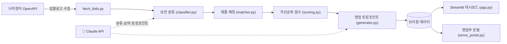

<div align="center">

# 🛡️ 나라장터 보안 입찰 분석 AI 봇

**공공기관 입찰공고(나라장터)를 자동 수집하고, AI가 우리 제품과 맞는 보안 공고만 골라 점수·요약·영업 토킹포인트까지 만들어 주는 영업 코파일럿.**

영업 담당자가 매일 수백 건의 공고를 손으로 뒤지던 일을, 한 화면에서 끝냅니다.


<!-- 배포 후 아래 라이브 데모 링크를 실제 주소로 교체하세요 -->
**🔗 라이브 데모:** https://narajangteo-bid-ai.streamlit.app · **💻 소스:** https://github.com/yeodh10/sales

</div>

---

## 📌 한눈에 보기 (왜 만들었나)

공공 보안 솔루션 영업에서 입찰공고 모니터링은 매일 반복되지만 시간이 많이 드는 일입니다.

- 나라장터에는 하루에도 수백 건의 공고가 올라옵니다.
- 그중 **우리 제품(방화벽·백신·보안관제 등)과 맞는 공고**는 일일이 검색해 찾아야 합니다.
- 놓치면 그대로 영업 기회 손실로 이어집니다.

이 봇은 그 과정을 자동화합니다. **수집 → 보안 공고 선별 → 제품 매칭 → 우선순위 점수 → 영업 토킹포인트 초안**까지 한 번에 처리해, 담당자는 "검토와 판단"에만 집중하면 됩니다.

> 💡 핵심 메시지: *"영업하는 사람이, 자신의 영업 업무를 직접 AI로 자동화했다."*

---

## 🖼️ 화면

이 도구는 두 가지 화면을 제공합니다 — 분석가용 **Streamlit 대시보드**와, 영업팀 공유용 **코파일럿 포털**(점수 보드·멘트 복사·담당자/메모 협업). 실제 화면은 아래 라이브 데모에서 바로 확인할 수 있습니다.

<!-- 스크린샷 추가 자리: docs/screenshots/ 에 아래 PNG 4장을 넣은 뒤, 이 회색 주석 블록(첫 줄의 여는 기호와 맨 끝의 닫는 기호)을 통째로 지우면 이미지가 표시됩니다.
<div align="center">

**영업부 코파일럿 포털 — 메인**


**우선순위 공고 보드 — AI 점수·등급·추천제품·토킹포인트**


**공고 카드 — 점수·근거·멘트 복사·담당자/상태 관리**


**Streamlit 대시보드 — 필터·표·CSV 다운로드**


</div>
-->

---

## 🔄 동작 방식



---

## ✨ 주요 기능

- **자동 수집** — 조달청 나라장터 공공데이터 OpenAPI로 입찰공고를 자동으로 가져옵니다.
- **AI 선별** — Claude(LLM)가 공고를 읽고 보안 관련 여부·카테고리(방화벽·백신·관제 등)를 분류합니다.
- **제품 매칭** — 제품 카탈로그(`catalog.json`)와 공고를 연결해 어떤 제품을 제안할지 추천합니다.
- **우선순위 스코어링** — 적합도·카테고리 전략가중·마감 임박도를 0~100점으로 환산해 먼저 볼 공고를 위로 올립니다.
- **영업 토킹포인트 생성** — 공고별 "고객 요구 / 우리 강점 / 차별점 / 한 줄 멘트"를 초안으로 만듭니다.
- **두 가지 화면** — 분석가용 **Streamlit 대시보드**와, 영업팀 공유용 **코파일럿 포털**(상태·담당자·메모 협업).
- **RFP 분석** — 제안요청서(PDF)에서 요구사항을 추출해 제품 대응표를 만듭니다.
- **매일 아침 브리핑** — 신규 보안공고만 골라 날짜별 마크다운으로 저장합니다(중복 제외).

---

## 🖥️ 두 가지 화면

| 화면 | 실행 | 용도 |
|------|------|------|
| **Streamlit 대시보드** (`app.py`) | `streamlit run app.py` | 필터·표·CSV 다운로드. **온라인 배포 대상.** |
| **영업부 코파일럿 포털** (`serve_portal.py`) | `python serve_portal.py` | 점수 보드·멘트 복사·담당자/상태/메모 팀 협업 화면. |

---

## 🧰 기술 스택

| 구분 | 사용 기술 |
|------|-----------|
| 언어 | Python 3.12 |
| AI | Anthropic Claude API (LLM) |
| 데이터 | 공공데이터포털 나라장터 입찰공고 OpenAPI |
| 화면(UI) | Streamlit · 정적 HTML/CSS/JS 포털 |
| 기타 | requests, pandas, pypdf, python-dotenv |

> **솔직한 포지셔닝:** 개발이 본업은 아닙니다. AI 코딩 도구를 적극 활용해 빠르게 만들되,
> **문제 정의 · 구조 설계 · 결과 검증은 직접** 했습니다. "AI 도구를 잘 쓰는 영업"이 이 프로젝트가 보여주려는 강점입니다.

---

## ▶️ 직접 실행해보기 (로컬)

### 1) 설치

```powershell
# Python 3.12 기준
python -m venv venv
venv\Scripts\python.exe -m pip install -r requirements.txt
```

### 2) 환경변수 설정

`.env.example`을 복사해 `.env`를 만들고 키를 채웁니다. (`.env`는 git에 올라가지 않습니다)

```powershell
Copy-Item .env.example .env
```

| 변수 | 설명 | 발급처 |
|------|------|--------|
| `ANTHROPIC_API_KEY` | Claude API 키 (분류·매칭·토킹포인트에 필요) | https://console.anthropic.com |
| `ANTHROPIC_MODEL` | 사용할 모델 (기본 `claude-sonnet-4-6`) | - |
| `DATA_GO_KR_SERVICE_KEY` | 나라장터 입찰공고 인증키 (실데이터 수집에 필요) | https://www.data.go.kr/data/15129394/openapi.do |

### 3) 키 없이 먼저 둘러보기

키가 없어도 **예시 데이터로 전체 흐름**을 볼 수 있습니다.

```powershell
venv\Scripts\streamlit run app.py
```

사이드바에서 `📁 저장된 브리핑 (무료)` 모드를 고르면 미리 만들어 둔 예시 브리핑이 그대로 표시됩니다.
Anthropic 키를 넣으면 `⚡ 지금 분석` 모드로 실시간 분류·매칭까지 돌려볼 수 있습니다.

> 단계별(Phase 0~7) 검증 방법은 [docs/DEVELOPMENT.md](docs/DEVELOPMENT.md)에 정리돼 있습니다.

---

## ☁️ 온라인 배포 (Streamlit Community Cloud)

채용담당자가 설치 없이 브라우저로 바로 볼 수 있게 무료로 배포할 수 있습니다.
전체 단계는 **[DEPLOY.md](DEPLOY.md)** 참고. 요약:

1. 이 저장소를 GitHub에 **공개(public)** 상태로 둡니다.
2. https://share.streamlit.io 에 GitHub로 로그인합니다.
3. 저장소 `yeodh10/sales`, 브랜치 `main`, 메인 파일 `app.py`를 지정하고 Deploy.
4. (선택) 실시간 분석을 켜려면 Settings → Secrets에 키를 넣습니다. **넣지 않으면 예시 데모로만 동작해 비용·남용 걱정이 없습니다.**

---

## 🔒 보안 · 주의사항

- API 키·인증키는 반드시 `.env`(로컬) 또는 Streamlit Secrets(배포)로 관리하며 **git에 커밋하지 않습니다.**
- 입찰 참여 결정은 **항상 사람이 최종 검증**합니다. 이 도구는 후보를 빠르게 추려주는 보조 수단입니다.
- 공공데이터·제품정보는 모두 공개 범위 내에서만 사용합니다.

---

## 📂 주요 모듈

| 파일 | 역할 |
|------|------|
| `config.py` | `.env`/Secrets 로더 · 키 가드 |
| `narajangteo.py` | 나라장터 입찰공고 수집·파싱 |
| `classifier.py` | 보안 여부·카테고리 분류 |
| `matcher.py` | 제품 카탈로그 매칭 |
| `scoring.py` | 영업 우선순위 점수(AI 없이 결정론적) |
| `generator.py` | 영업 토킹포인트 생성 |
| `pipeline.py` | 분류 → 매칭 → 토킹포인트 오케스트레이션 |
| `agent.py` | tool use 기반 에이전트 |
| `app.py` | Streamlit 대시보드 |
| `serve_portal.py` · `portal/` | 영업부 코파일럿 포털(팀 공유 화면) |
| `rfp_extract.py` | RFP PDF 요구사항 추출·대응표 |
| `daily_brief.py` | 매일 아침 신규 보안공고 브리핑 |

---

<div align="center">

*개인 프로젝트 · 보안/IT 솔루션 기술영업 포트폴리오*

</div>
